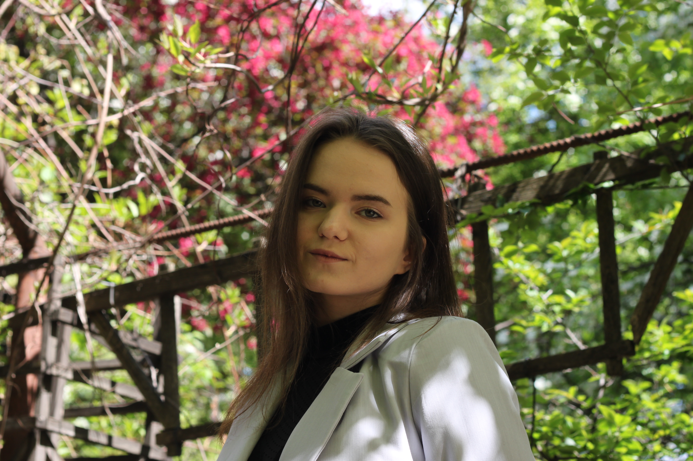

# [rsschool-cv](https://kkoaalla.github.io/rsschool-cv/cv)

## Tanya Bogacheva



<hr>

## Contacts

- **Phone:** +7 985 141-89-66
- **Email:** tatiana.bogacheva.a@gmail.com
- **Telegram:** @kkoaalla
- **Rs school discord server:** Tatiana Bogacheva (@kkoaalla)

<hr>

## About me
Last year, I graduated from the university with a degree in engineering. I studied programming at School 21 in Moscow. I'm currently working as a software engineer, and I want to retrain as a frontend developer. I love learning new things and working in a team.

<hr>

## Skills
- Python
- C
- JavaScript Basics
- HTML, CSS
- Git, GitHub, GitLab

<hr>

## Code example
```
var a1="A",a2="a",b1="B",b2="b",c1="C",c2="c",d1="D",d2="d",e1="E",e2="e",n1="N",n2="n"
function Dad(){
  //select some variable to combine "Dad"
  return d1+a2+d2;
}
function Bee(){
  //select some variable to combine "Bee"
  return b1+e2+e2;
}
function banana(){
  //select some variable to combine "banana"
  return b2+a2+n2+a2+n2+a2;
}
```

<hr>

## Project experience

[CV](https://github.com/kkoaalla/rsschool-cv)

<hr>

## Courses

1. Front-End Self-Paced Online Program on [EPAM](https://learn.epam.com/). (In progress)
2. Responsive Web Design on [Free Code Camp](https://www.freecodecamp.org/). (In progress)
3. Introduction to JavaScript on [Sololearn](https://www.sololearn.com/). (Completed)

<hr>

## Languages:
- English - Upper-intermediate
- Russian - Native